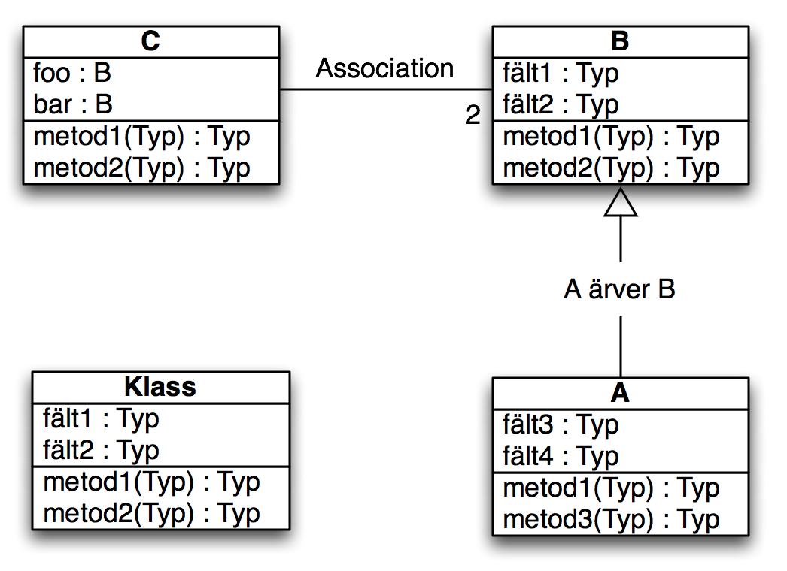

# Lektion 4

Denna lektion går ut på att öva på att extrahera en
objektorienterad modell från en specifikation, en
fortsättning/upprepning av vad som gjordes på föreläsning 18.
Lektionen syftar till att:

1. Drilla klass vs. objekt
2. Hitta relationer mellan klasser
3. Hitta relationer mellan objekt
4. Etablera en enkel ritnotation (utsnitt av [UML](https://sv.wikipedia.org/wiki/Unified_Modeling_Language)) som vi kan använda för att beskriva objektorienterade program

Lektionen går ut på att gå igenom nedanstående beskrivning av ett
systam och identifiera klasserna och objekten, utforska lämpliga
sätt att modellera relationer mellan objekt och hitta relationer
mellan klasser.

Om något i beskrivningen känns otydligt -- fatta ett eget beslut.
Väg fördelar mot nackdelar. Dokumentera.

## Ritnotation

Vi använder ett litet utsnitt av modelleringsspråket UML som
används mycket flitigt i industrin för att designa och dokumentera
objektorienterade program. Nedan finns ett exempel som visar tre
klasser: `A`, `B` och `C`. Pilnotationen mellan `B` och `A` visar
att `A` är en subklass till `B`. Det finns också en association
mellan `C` och `B`. En association i UML kan betyda många olika
saker, och dokumenterar en koppling mellan klasserna, t.ex. att
objekt av klassen `C` någonstans manipulerar objekt av klassen
`B`. Här begränsar vi oss till att enbart beakta associationer som
betyder "objekt av klassen X sparar referenser av objekt av
klassen Y i något fält".

Det är ofta bra att sätta ut multipliciteter i diagrammet, dvs.
hur många `B`-objekt ett `C`-objekt är kopplat till. Vi skriver
`*` för *noll eller flera*. I exemplet visas att ett `C`-objekt är
kopplat till 2 `B`-objekt och att relationen är "enkelriktad".
(Det går utmärkt att sätta ut pilar för ökad tydlighet!)

## Ett socialt nätverk

Det sociala nätverket FooBar fungerar ungefär som Facebook. Varje
användare har en profil, och varje profil är knuten till noll
eller flera vänner. Det finns flera sorters vänner, nära vänner,
familj, partners, och övriga. En användare kan posta
statusuppdateringar som kan nämna andra profiler. En
statusuppdatering kan gillas eller ogillas av användare (inklusive
postaren själv), samt kommenteras på. Varje enskild kommentar kan
också gillas eller ogillas av användare som kan se den.

Statusuppdateringar kan vara antingen en kort textsnutt, en längre
text, eller en bild. På samma sätt som textsnutter kan nämna andra
profiler kan bilder "tagga" andra profiler. 

Till varje profil finns knuten en händelselogg som innehåller
statusuppdateringar i omvänd kronologisk ordning, dvs. senast
först. I en händelselogg för användaren A visas alla
statusuppdateringar som A har gjort, samt alla relevanta
statusuppdateringar för alla vänner. En statusuppdatering hos en
nära vän anses alltid relevant, men för övriga gäller att den
skall vara "het" eller att A nämns i statusuppdateringen eller
någon av dess kommentarer. En statusuppdatering anses vara het om
den antalet gillanden + antalet ogillanden + antalet kommentarer
övserstiger ett visst tröskelvärde T. Tröskelvärdet finns i
användarens profil och kan variera från användare till användare.

Användare kan "knuffa till" varandra. Om A knuffar till B betyder
detta att A:s alla statusuppdateringar anses relevanta för B i en
vecka och tvärtom. Man kan inte ha fler än 5 "aktiva knuffar"
samtidigt. 

En användare kan be om att få bli vän med en annan användare, som
måste tacka ja först. Vänskap är en symmetrisk relation (dvs. om A
är vän med B är B också vän med A). En användare kan lista en
eller flera vänner som nära vänner. Nära vänskap är inte
nödvändigtvis symmetrisk. En särskild kategori av nära vänskap
finns dock som är symmetrisk, närmligen släktskap och "i ett
förhållande". En användare kan ange en eller flera vänner som
släkt/i ett förhållande. Man kan utan vidare säga upp alla typer
av vänskap, inklusive nära vänskap och förhållanden. Symmetriska
relationer som sägs upp sägs automatiskt upp från båda håll.

Användare kan vara medlemmar i grupper. En grupp består av en
eller flera medlemmar med minst en medlem som administratör (som
har rätt att lägga till och ta bort användare, och skapa nya
administratörer). En grupp har en händelselogg, precis som en
användare. Poster ur en grupps händelselogg anses som poster från
en vän när en användares händelselogg skall visas/räknas ut. 
